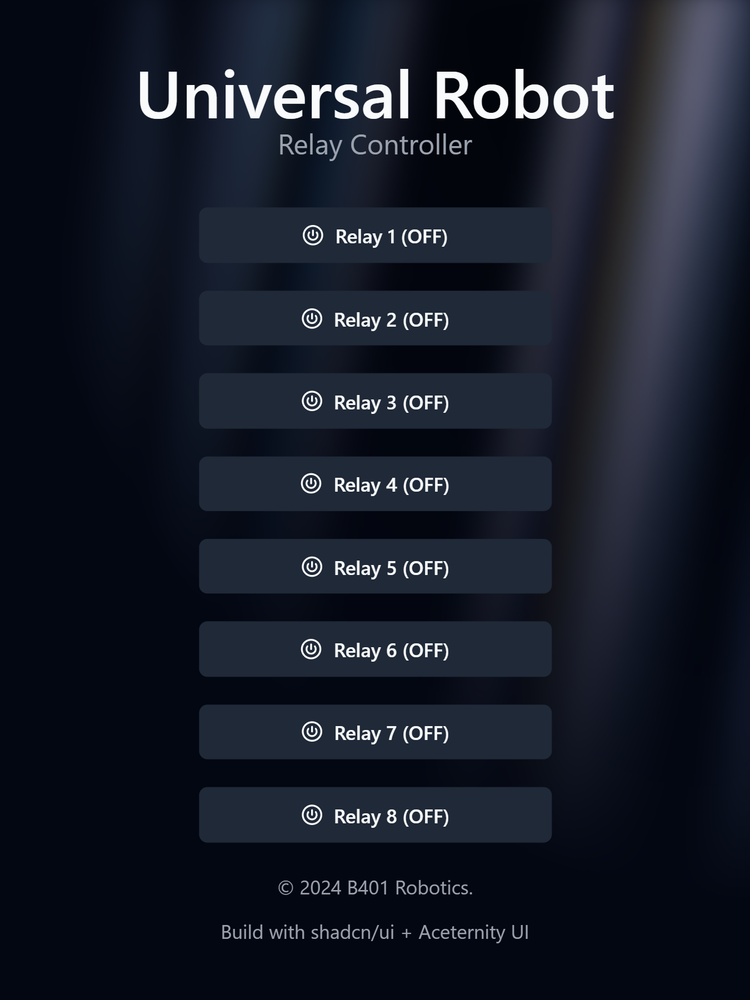
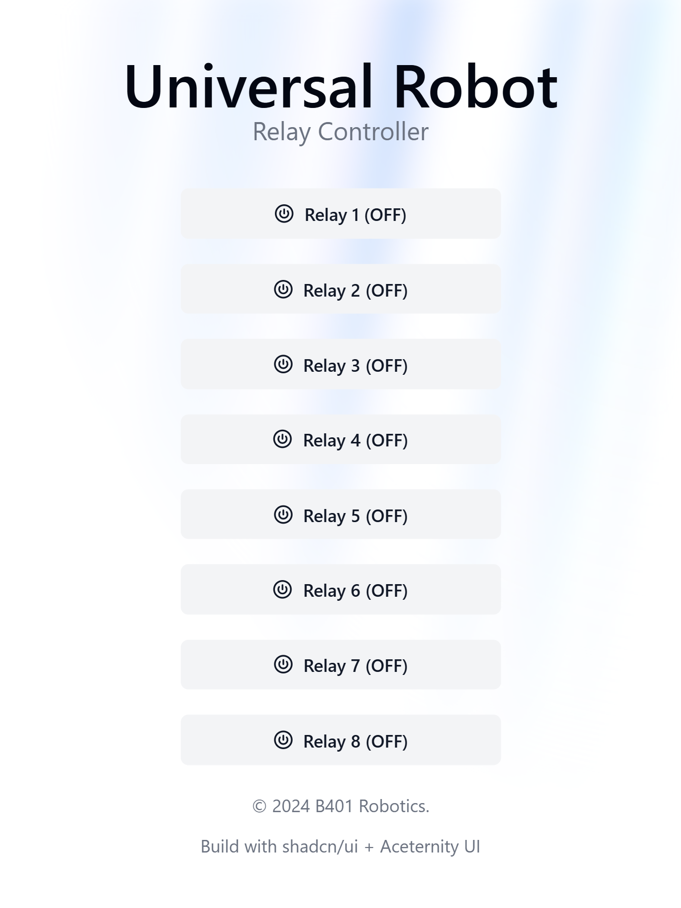

<h1 align="center">ESP32 Universal Robot</h1>

<p align="center">
	</a>
	</a>
	</a>
</p>

This project involves firmware for an ESP32 connected to an 8-channel relay module. The relay module is utilized to control a Universal Robot as a digital input.

## 🌟 Features

- Firmware built with Arduino and PlatformIO
- Web Application built with React and attached to ESP32
- API for controlling the relays

### Preview

|            Dark Mode Preview            |            Light Mode Preview             |
|:---------------------------------------:|:-----------------------------------------:|
|  |  |


## 🚀 Getting Started

### Prerequisites

- [PlatformIO](https://platformio.org/)
- [Node.js](https://nodejs.org/)

### Installation

1. Clone the repository
   ```sh
   git clone
    ```

2. Create a new file named `secret.h` in the `src` folder and add the following code:
   ```cpp
    #pragma once

    #define WIFI_SSID "YOUR_WIFI_SSID"
    #define WIFI_PASSWORD "YOUR_WIFI_PASSWORD"
    ```

3. Build and upload the firmware to the ESP32
   ```sh
   pio run -t upload
   ```

4. Build and upload web interface to ESP32 filesystem image
   ```sh
   pio run -t uploadfs
   ```
   > Dependecies for web interface are installed automatically by PlatformIO when you build filesytem image. For more information about script, check `script` folder.

## 📝 Documentation

### API

- `GET /ip` - Get the IP address of the ESP32
- `GET /status` - Get the status all of the relays
- `POST /relay/:id` - Set the state of the relay with the specified ID
    - Content-Type: application/x-www-form-urlencoded
    - Body: `state` ("on" or "off")
- `POST /relay/all` - Set state of all relays at once
    - Content-Type: application/x-www-form-urlencoded
    - Bodu: `states` ["on", "off", "on", "off", "on", "off", "on", "off"] --> just example

## ✅ To-Do
- Fix indexing mistake between the UI and the actual relay id